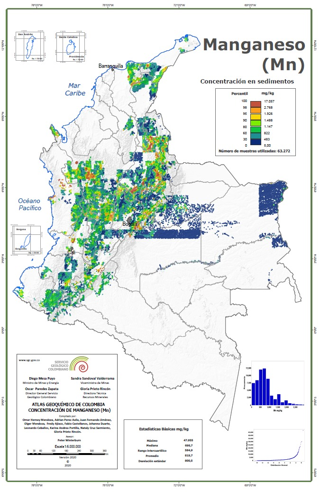

# AnalisisGeoespacial-Geoquimica
Este repositorio albergará la información relacionada con el proyecto del curso de Análisis Geoespacial.

## Análisis Geoespacial de concetraciones de Manganeso (Mn) en Colombia

### 1.  ***Presentación del problema***

Con el propósito de construir el mapa geoquímico de colombia, se recolectaron y analizaron muestras de sedimentos de corriente en distintas regiones del país. Entre los 57 elementos analizados, se seleccionó como caso de estudio al manganeso (Mn) debido a su relevancia geoquímica y a la disponibilidad de una mayor cantidad de datos. 

<figure>
    
    <figcaption>Mapa Geoquímico de Colombia para Manganeso.</figcaption>
    </figure>
  
Para la construcción del mapa se aplicó una técnica de interpolación espacial basada en el **algoritmo modificado del Inverso de la Distancia Ponderado (IDWm)**, sin una estimación explícita de la **incertidumbre** asociada a cada predicción espacial. 

Este algoritmo para estimar el valor de un punto no muestreado, toma los valores de los puntos muestreados cercanos y se pondera inversamente proporcional a su distancia al punto de interés, limitando o expandiendo la cantidad de puntos cercanos considerados. 

>#### ***No maneja incertidumbre*** 

> - ¿Qué tan confiable es la predicción?
>
> - ¿Cómo varia la concentración elemental en el territorio según estos datos?
>
> - ¿Qué tanto se ajustan a la realidad?

### 2.  ***Objetivo***

Aplicar métodos alternativos de **interpolación espacial** que permitan estimar la distribución del Mn, comparando sus resultados con el algoritmo IDWm, con el fin de evaluar la **calidad de la estimación espacial**, como también la **cuantificación de la incertidumbre**. 

### 2. ***Métodos alternativos de interpolación espacial***

- Enfoque geoestadísito: **Kriging**
- Procesos Gausseanos: **Gaussian Process Regression (GPR)**

